# **KS0305 Keyestudio Micro:bit V2.0 Basic Starter Kit**

# 1. Introduction：

Micro:bit, designed by BBC, helps senior students learn programming. It is richin on-board source including a 5\*5 LED dot matrix, two programmable buttons, compass, micro USB ports and a Bluetooth module.

It is only half the size of a credit card (4cm×5cm), but very mighty. Moreover,it can be used to edit video games, sound and light interaction, robot control,scientific experiments, wearable device and so on.

The new micro:bit V2 has a MEMS microphone, a touch logo and a buzzer which you can play sound everywhere. In addition, the edge connector can fix the crocodile clip easily.

Its sleep mode can be activated by pressing long reset/power button, which canreduce the power consumption of battery. And its CPU performance is better than V1.5. To sum up, its performance increase a lot. What do you create today? Have a try!

**Micro:bit Pinout**

Micro:bit V2

Micro:bit V1.5

**V2 VS V1.5：**

You can reboot micro:bit V2 when pressing reset and power button.

LED will get dark and the power-saving mode will be activated if you keeppressing reset and power button, which can make the life expectancy of batterieslonger and activate micro:bit.

**More resource：**

<https://tech.microbit.org/hardware/>

https://microbit.org/new-microbit/

https://www.microbit.org/get-started/user-guide/overview/

<https://microbit.org/get-started/user-guide/features-in-depth/>

**Micro:bit Pinout**

 Micro:bit V2
 Micro:bit 1.5

Official website：

<https://tech.microbit.org/hardware/edgeconnector/>

<https://microbit.org/guide/hardware/pins/>

Note:

a. Put it on with silicone case to prevent the short circuit due to electronic components on micro:bit V2

b. Don’t interface V2 board with high current components(such as servo MG995, DC motor) because of its weak driving ability (less than 300mA)of IO port,otherwise, it will be burned out.

We recommend you to work with micro:bit expansion board before using it.

c. We supply power via USB port or 3V port of micro:bit V2. However, themicro:bit shield is needed if you use 5V sensor because its voltage is 3V.

d. Remember to disable(you can use this block to disable the pin)the common pins of micro:bit like P3, P4, P6, P7 and P10 in the code, otherwise, the data will be wrong.

e. The battery above 3.3V is not allowed to be used, otherwise, micro:bit V2will get damaged.

f. Don’t put it on the metal object to avoid short circuit.

To conclude, micro:bit V2 is like a mini computer.

Online coding website: <https://microbit.org/code/>

# 2. Product Kit：

|  \#  |       Model        | QTY  |                           Picture                           |
| :--: | :----------------: | :--: | :---------------------------------------------------------: |
|  1   | Micro:bit V2 Board |  1   |  |
|  2   | 1m Micro USB Cable |  1   |      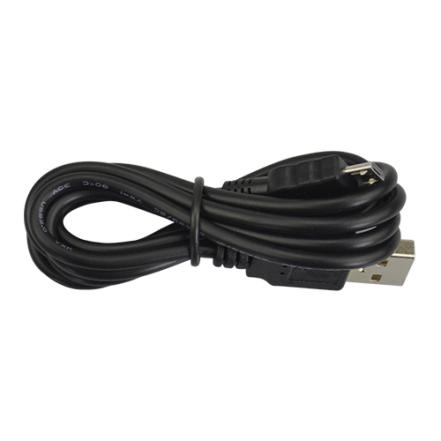      |
|  3   |   Battery Holder   |  1   |      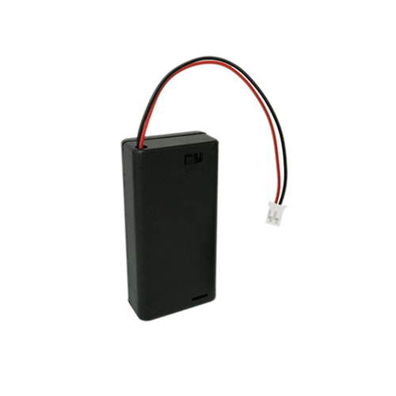      |

# 3. Install the Driver of Micro:bit

The installation of driver wouldn't be needed, if you already installed it. But, you need to install driver if it’s your first use.

Download link: https://fs.keyestudio.com/KS0305-Driver

You can download driver file () in the folder.

# 4. Programming

We will take Windows system as example.

4.1 Quick Start

This chapter introduces how to program and download code to micro:bit V2. There are detailed tutorials in the official website, as shown below:

[https://microbit.org/guide/quick/](Https://microbit.org/guide/quick/)

Step 1: Connect Micro:bit V2

Interface micro:bit V2 with your computer using USB cable. （Guide to mobile &tablet apps：<https://microbit.org/get-started/user-guide/mobile/>).

Macs , PCs, Chromebooks and Linux system（including Raspberry Pi）support micro：bit V2.

After board is connected to computer, a red LED at the back of micro:bit V2 will be on.

Step 2: Programming

Enter <https://makecode.microbit.org/> (we recommend you to use Google Chrome)

Click  and you will view a dialog box.

Input “heartbeat” to name your project and click “Create”.

What’s more, you can download Makecode app if your system is Windows 10:
[https://www.microsoft.com/zh-cn/p/makecode-for-micro-bit/9pjc7sv48lcx?ocid=badgep&rtc=1&activetab=pivot:overviewtab](https://www.microsoft.com/zh-cn/p/makecode-for-micro-bit/9pjc7sv48lcx?ocid=badgep&rtc=1#activetab=pivot:overviewtab)

Through MakeCode editor, you just need to drag blocks from block area into code editing area to program. Then run this code on simulator of makecode, as shown below:

We provide a guidance video in the test code folder(download test code in the link [https://fs.keyestudio.com/KS03](https://fs.keyestudio.com/KS0428)05

Step 3: Download Code

The code can be directly downloaded to micro:bit V2 if you tap“Download”icon on makecode App.

However, follow the steps below if you program via online makecode editor.

Enter online Makecode editor, tap“Download”to get a“hex”file. Then copy it into MICROBIT drive.

Or you can find out“hex”file firstly and right-click to select“Send to”MICROBIT（E）”.

Then hex file will be copied on MICROBIT drive.

The yellow indicator will flash when transferring“hex” into micro:bit V2. And it is solid on after the file is copied.

Step 4: Run Program

Download code to micro:bit V2 and connect micro:bit V2 to external power with USB cable.

5 x 5 LED will show heartbeat pattern.

 

Power Supply-----micro USB
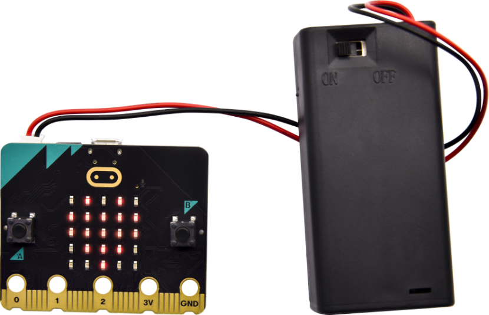 

External Power（3V)

**Step5：Acknowledge：**

You can code in other ways:

<https://microbit.org/code/>

<https://microbit.org/projects/>

4.2. Makecode

Navigate <https://makecode.microbit.org/> on Google Chrome, and enter online makecode editor. Or you can open makecode app for Windows 10.

Click“New Project”, input“heartbeat”, click“Create”and enter Makecode editor, as shown below:

There are block“on start”and“forever”in the code editing area.

After power on or reset,“on start”block means that command blocks in the code are only run once, however,“forever”implies that code runs cyclically.

4.3. Quick Download

You can click“download”to transfer code to micro:bit V2 if you use makecode App for Windows 10.

Whereas, the online Makecode editor requires intricate steps.

Operating Google Chrome on Android, ChromeOS, Linux, macOS or Windows 10 system, you can achieve the quick download.

We use the webUSB function of Chrome to allow the internet page to access the hardware device connected USB.

You can refer to the following steps to connect and pair device.

**Pairing Device:**

Interface micro:bit V2 with computer using USB cable.

Click “...” beside “Download” and tap “Pair device”.

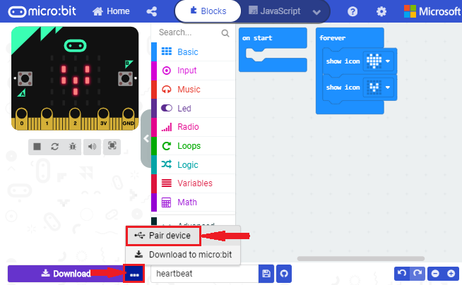

Continue to tap “Pair device”.

Then select the device you want to connect and tap“connect”in the window .

If there is no device in the window, please refer to the following link:

[https://makecode.microbit.org/device/usb/webusb/troubleshoot](https://makecode.microbit.org/device/usb/webusb/troubleshoot%20)

We also provide in the resource link.

What’s more, if you don’t know how to update the firmware of micro:bit, refer to the link:[https://microbit.org/guide/firmware/](https://microbit.org/guide/firmware/%20) or browse folderwe provide.

After connecting successfully, press buttons and download code to micro:bit V2.

4.4. Resource

https://fs.keyestudio.com/KS0305

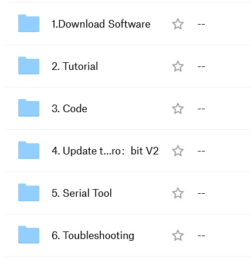

4.5. Import Code

We provide every program with a hex file. You can import it directly or program in Makecode blocks area.

Next, we will take“heartbeat”as example to introduce how to import code.

Open online Makecode or Makecode App.

Tap “import” and “Import File”.

Choose file **“../Makecode Code/Project 1\_ Heart beat/Project 1\_ Heart beat.hex”**, then tap “Go ahead”

In addition to the above method of importing code, you can also directly drag code into the Makecode compiler, as shown in the figure below:

The program is imported successfully after a few seconds.

If your computer system is Windows7/8 instead of Windows 10, the device can’t be paired in Google Chrome, as a result, the digital and analog signals can’t be read.

Here, we need CoolTerm software to read data. For the whole projects, we will use CoolTerm software. Let’s install it firstly.

4.6. Install CoolTerm

CoolTerm program is used to read the serial communication.

Download CoolTerm program:

<https://freeware.the-meiers.org/>

1.  After the download, we need to install CoolTerm Win, and we take example of the Window system

2.  Choose“win”

3.  Unzip file and open it. (also suitable for Mac and Linux system)

Double-click 

**Note:** Firstly, you have to install the driver of micro:bit and connect micro:bit V2 to computer.

The functions of each button on the toolbar are listed below:
<http://wiki.keyestudio.com/index.php/File:IDE.png>

|         | Opens up a new Terminal                           |
|--------------------------------------------------------|---------------------------------------------------|
|         | Opens a saved Connection                          |
|         |  Saves the current Connection to disk             |
|  | Opens the Serial Connection                       |
|  | Closes the Serial Connection                      |
|  | Clears the Received Data                          |
|  | Opens the Connection Options Dialog               |
|  | Displays the Terminal Data in Hexadecimal Format  |
|         | Displays the Help Window                          |

# 5. Projects

## Project 1: Heartbeat

**1. Description**

Prepare a Micro:bit V2, a USB cable and a computer. Next we will conduct a basic experiment that a heartbeat pattern flashes on micro:bit board.

**2. Components**

-   Micro:bit V2 \*1

-   Micro USB Cable\*1

**3. Wiring Up**

Interface micro:bit V2 with your computer using micro USB cable.

**4. Example Code**

You can enter this website **[https://makecode.micro:bit.org/reference](https://makecode.microbit.org/reference)** to get more information even you’re a starter.

Edit your code in the link: [https://makecode.micro:bit.org/](https://makecode.microbit.org/)

**5. Test Result**

Download code to micro:bit V2 (refer to chapter 4.1), and keep micro USB cable connected. Then image“❤”and“”will be shown on micro:bit ceaselessly.

If download unsuccessfully, disconnect micro:bit V2 and reboot it. Then download code to V2 board again

## Project 2: Light Up A Single LED

**1. Description**

In this project, we will turn on an LED of micro:bit V2.

**2. Components**

-   Micro:bit V2 \*1

-   Micro USB Cable\*1

**3. Wiring Up**

Interface micro:bit V2 with your computer using micro USB cable.

**4. Component Overview**

Micro:bit V2 consists of 25 light-emitting diodes, 5 pcs in a group. They correspond to x and y axis. Then the 5\*5 matrix is formed. Moreover, every diode locates at the point of x and y axis.

Virtually, we can control an LED by setting coordinate points. For instance, set coordinate point（0，0）to turn on the LED at row 1 and column 1; light up LED at the row 1 and column 3, we can set（2，0) and so on.

**5. Test Code**

**6. Test Result**

Download code to micro:bit V2 and connect it to computer with USB cable. As a result, the LED at coordinate point (1,0) flashes for 1 s and the LED at (3,4）blinks for 1s, alternately.

## Project 3: 5 x 5 LED Dot Matrix

**1. Description**

Dot matrix gains popularity in our life, such as LED screen, bus station and the mini TV in the lift.

The dot matrix of Micro:bit board consists of 25 light emitting diodes. In previous lesson, we control LED of Micro:bit board to form patterns, numbers and character strings by setting the coordinate points. Moreover, we could adopt another way to complete the display of patterns, numbers and character strings.

**2. Components**

-   Micro:bit V2 \*1

-   Micro USB Cable\*1

**3. Wiring Up**

Interface micro:bit V2 with your computer using micro USB cable.

**4. Example Code**

****

**5. Test Result**

Download code to micro:bit V2, and and keep USB cable connected. Micro:bit V2 will display 1, 2, 3, 4 and 5 and separately show “Hello!”,  , ,,, andpatterns.

## Project 4: Programmable Buttons

**1. Description**

The circuit is controlled by button. The circuit is connected when the button is pressed; however, the circuit is disconnected when released.

Micro:bit V2 has three buttons which are the reset button on the back and two programmable buttons(A, B) on the front. Next, let’s conduct experiment to know how button works.

**2. Components**

-   Micro:bit V2 \*1

-   Micro USB Cable\*1

**3. Wiring Up**

Interface micro:bit V2 with your computer using micro USB cable.

**4. Example Code 1**

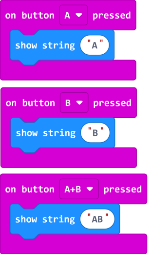

**5. Test Result 1**

Download code to micro:bit V2 and keep USB cable connected.

5×5 LED dot matrix will show the corresponding letter if the button A or B is pressed. In other words, the micro:bit V2 will also show“AB”if you press A and B buttons simultaneously.

**6. Example Code 2**

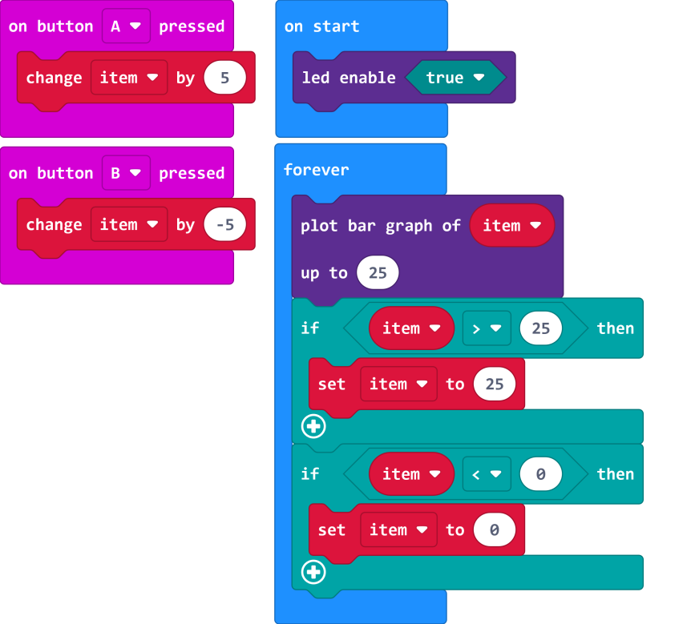

**7. Test Result 2**

Download code to micro:bit V2 and keep USB cable connected. A row of luminous LEDs are added if button A is pressed; and when B is pressed, a row of luminous LEDs are deducted.

## Project 5: Temperature Measurement

**1. Description**

We will introduce how to detect ambient temperature by micro:bit V2. Its detection range is -40℃\~105℃.

**2. Components**

-   Micro:bit V2 \*1

-   Micro USB Cable\*1

**3. Wiring Up**

Interface micro:bit V2 with your computer using micro USB cable.

**4. Test Result**

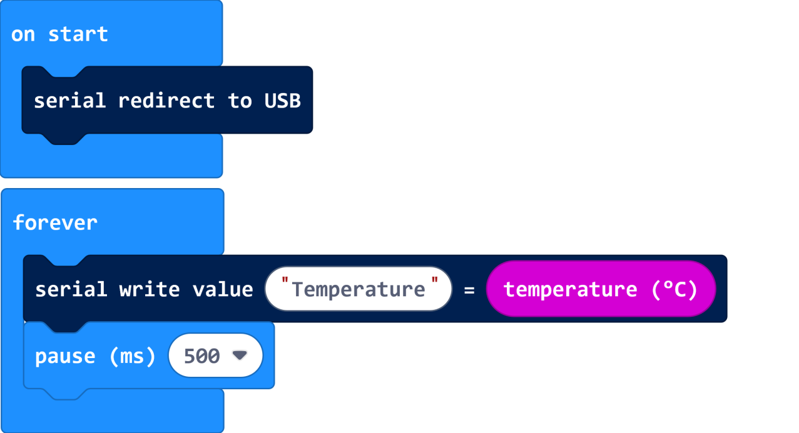

**5. Test Result**

Download code to micro:bit V2 and plug in power with USB cable. Then click“Show console Device”button.

Open serial interface to check temperature value, as shown below：

If your computer system is Windows7/8 instead of Windows 10, the device can’t be paired in Google Chrome, as a result, the digital and analog signals can’t be read.

Here, we need CoolTerm software to read data.

Open“CoolTerm”, click“Options”to select“SerialPort”. Set COM port and 115200 baud rate(the baud rate of USB serial communication of micro:bit V2 is 115200 through the test). And click“OK”and“Connect”.

The serial monitor shows the current ambient temperature value, as shown below:

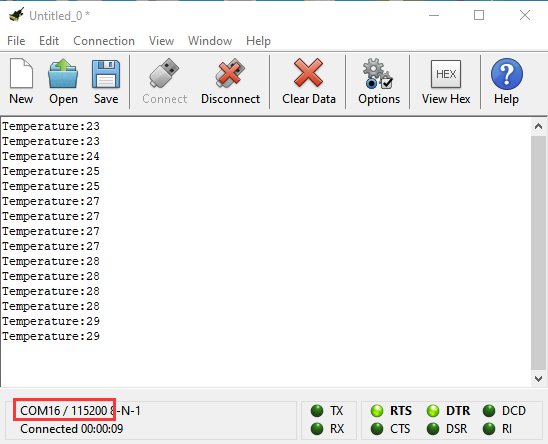

## Project 6: Micro:bit’s Compass

**1. Description**

This project mainly introduces the use of the Micro:bit’s compass. In addition to detecting the strength of the magnetic field, it can also be used to determine the direction, an important part of the heading and attitude reference system (AHRS) as well.  

It uses LSM303AGR three-axis magnetometer whose the range of magnetic field is ±50 gauss. In this project, we will introduce how compass detect data and determine direction.

Then we can read the value detected by it to determine the location. We need to calibrate the micro:bit V2 when magnetic sensor works.

**2. Components**

-   Micro:bit V2 \*1

-   Micro USB Cable\*1

**3. Wiring Up**

Connect micro:bit V2 to your computer using micro USB cable.

**4. Example Code1**

**5. Test Result1**

Download code to micro:bit V2 and keep USB connected.

As the button A is pressed, LED dot matrix indicates that“TILT TO FILL SCREEN”then enter the calibration interface.

The calibration method: rotate the micro:bit V2 to make LED dot matrix display a full square (25 LEDs are on), as shown in the following figure:

The calibration won’t be finished until you view the smile patternappear.

The serial monitor will show 0°, 90°, 180° and 270° when button A is pressed.

**6. Example Code2**

This block implies that the value is read ceaselessly and the arrow direction is North.

The micro:bit V2 shows the icon, if the value is between 292.5 and 337.5. The value should be 293 and 338 because decimal is not allowed to be filled in the code.

Seen from the above picture, the micro:bit V2 will show the northeastern arrow when the value is between 292.5 and 337.5. Yet, the decimal is not allowed to appear in the code, therefore, we determine value between 293 and 338.

**7. Complete Example Code2**

**8. Test Result 2**

Download code to micro:bit V2 and keep USB cable connected. After the calibration(see the result1) and tilt micro:bit V2, then the direction signs will be shown.

## Project 7: Accelerometer

**1. Description**

The micro:bit V2 has a built-in LSM303AGR three-axis acceleration sensor (accelerometer). Its I2C interface works on external communication, the range can be set to 1g, 2g, 4g and 8g. We usually detect the posture of accelerometer.

In this project, we will check the value detected by accelerometer.

**2. Components**

-   Micro:bit V2 \*1

-   Micro USB Cable\*1

**3. Wiring Up**

Interface micro:bit V2 with your computer using micro USB cable.

**4. Example Code 1**

**5. Test Result 1**

Download code to micro:bit V2 and keep USB cable connected. Micro:bit V2 will display“1”if shaken.

Place micro:bit V2 vertically(logo up), then the number 2 is displayed:

Place micro:bit V2 vertically(logo down), then the number 3 is displayed:

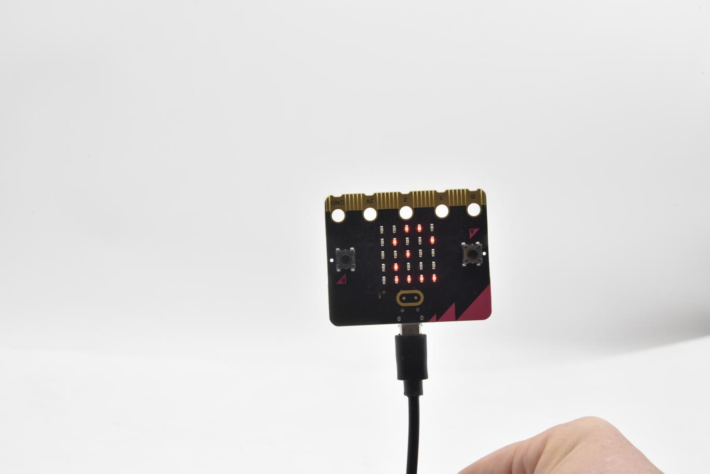

Place micro:bit V2 horizontally (facing up), then the number 4 is displayed:

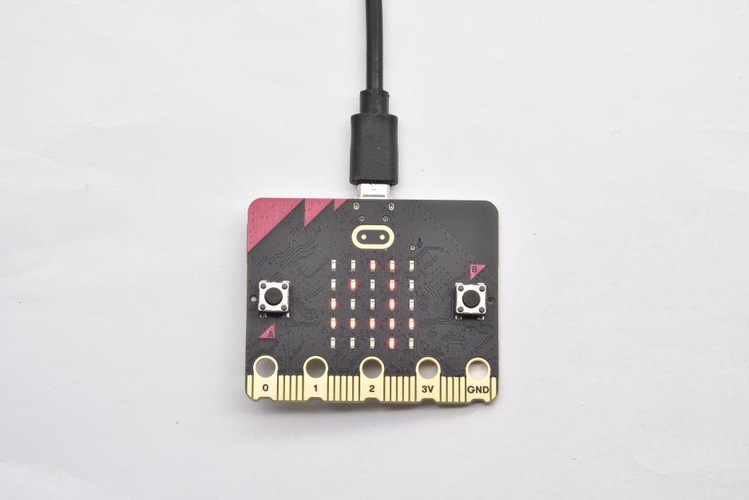

On the contrary, place micro:bit V2 horizontally (facing down), then the number 5 is displayed:

When Micro:bit board is tilt to the left, number 6 is shown.

When Micro:bit board is inclined to the right, number 7 is displayed.

When it is free fall (accidentally making it fall), number 8 will appear on dot matrix.（Note: we don’t recommend you to make it free fall, it will make board damage)

**6. Example Code 2**

**7. Test Result 2**

Download code to micro:bit V2, keep USB cable connected, and click “Show Console Device”

According to MMA8653FC manual, the acceleration coordinates of the accelerometer are shown in the following figure:

The decomposition value of acceleration on the X-axis, Y-axis, and Z-axis, and the synthesis value of acceleration (the synthesis of gravitational acceleration and other external forces) are shown below:

If your computer system is Windows7/8 instead of Windows 10, the device won’t be paired in Google Chrome.

Here, we need CoolTerm software to read data. Open CoolTerm, click“Options”to select“SerialPort”.

Set“COM”port and 115200 baud rate(the baud rate of USB serial communication of Micro:bit is 115200 through the test).

Click“OK”and“Connect”.

CoolTerm serial monitor displays the acceleration value on x, y and z axis, as shown below:

## Project 8: Detect Light Intensity by Micro:bit

**1. Description**

This project will introduce how micro:bit V2 detects the external light intensity. Since micro:bit doesn’t come with photosensitive sensor, the detection of light intensity is completed through the LED matrix. When the light irradiates the LED matrix, the voltage change will be produced. Therefore, we could determine the light intensity by voltage change.

**2. Components**

-   Micro:bit V2 \*1

-   Micro USB Cable\*1

**3. Wiring Up**

Interface micro:bit V2 with your computer using micro USB cable

**4. Test Code**

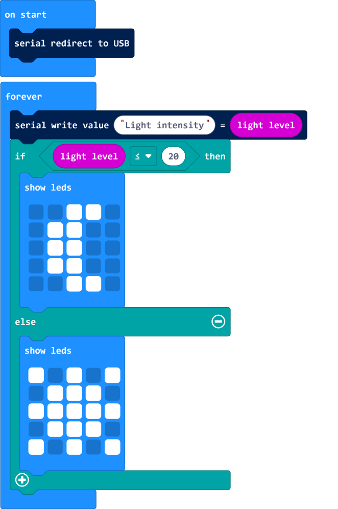

**5. Test Result**

Download code to micro:bit V2, keep USB cable connected, and click “Show Console Device”

The intensity value is about 0 when covering LED dot matrix. And the value varies with the light intensity. When placing micro:bit V2 under the sunlight, the stronger the light is, and the larger the intensity value is. As shown below:

Number 20 in the code is a random light intensity value we set. Micro:bit V2 will show“moon”picture when the light intensity is less than or equivalent to 20; however, the “sun”image will appear if the value is more than 20.

If your computer system is Windows7/8 instead of Windows 10, the device can’t be paired in Google Chrom.

Here, we need CoolTerm software to read data.

Open“CoolTerm”, click“Options”to select“SerialPort”, and set “COM” port and 115200 baud rate(the baud rate of USB serial communication of micro:bit V2 is 115200 through the test).

Then click“OK”and“Connect”.

The light intensity value is shown below:

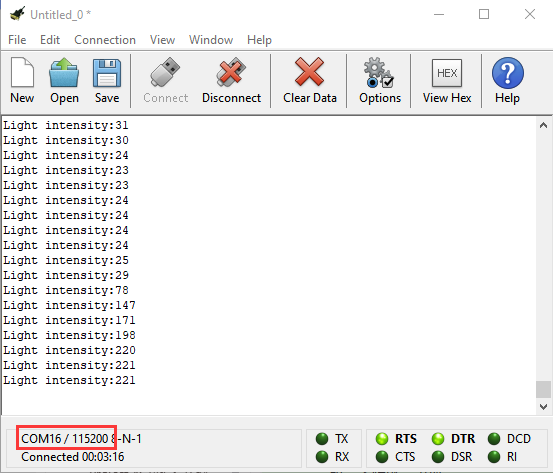

## Project 9: Speaker

**1. Description**

The micro:bit V2 has built-in speaker for emitting different tones. You can composite a song like“Ode to Joy”and other beautiful songs.

**2. Components**

-   Micro:bit V2 \*1

-   Micro USB Cable\*1

**3. Wiring Up**

Interface micro:bit V2 with your computer using micro USB cable.

**4. Test Code 1**

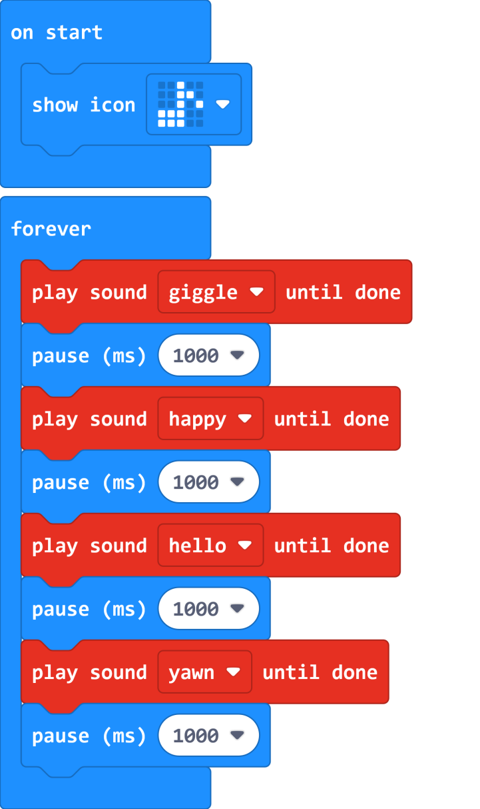

**5. Test Result 1**

Download code to micro:bit V2 and plug in power with USB cable. Then micro：bit V2 shows music icon and emits sound.

**6. Test Code 2**

**More resource**：

<https://en.wikipedia.org/wiki/Numbered_musical_notation>

**7. Test Result 2**

Download code to micro:bit V2 and plug in power with USB cable, as a result, micro:bit V2 emits song“Ode to Joy”.

## Project 10: Touch Sensitive Logo

**1. Description**

Micro:bit V2 has a touch sensitive logo as a input. It is fundamentally a
capacitive touch sensor which can sense the tiny changes in the current.

**2. Components**

-   Micro:bit V2 \*1

-   Micro USB Cable\*1

**3. Wiring Up**

Connect micro:bit V2 to your computer with micro USB cable.

**4. Example Code**

**5. Test Result**

Download code to micro:bit V2 and keep USB cable connected. Micro:bit V2 will show“❤”if you touch logo, on the contrary, the number will be shown if the logo  is not touched.

## Project 11: Microphone

**1. Description**

The micro:bit V2 has a built-in microphone which can detect the sound intensity.

The microphone LED indicator in the front of micro:bit V2 will be turned on if you clap your hands, therefore, we can make an analog noise level watch or display a disco light effect.

**2. Components**

-   Micro:bit V2 \*1

-   Micro USB Cable\*1

**3. Wiring Up**

Interface micro:bit V2 with your computer using micro USB cable.

**4. Test Code 1**

**5. Test Result 1**

Download code to micro:bit V2, and keep micro USB connected. Pattern“❤”will be displayed when you clap your hands; however, pattern“”will appear when in the quit environment.

**6. Example Code 2**

**7. Test Result 2**

Download code to micro:bit V2 and keep micro USB cable connected. Click“Show console device”.

The output sound value increases when the sound amplifies, as shown below;

Micro:bit V2 will show the maximum value of sound intensity(Note: set the maximum value via reset button), when button A is pressed; whereas, the sound level icon will be shown when clapping your hands.

## Project 12: Read Bluetooth Data

**1. Description**

The micro:bit V2 comes with a [nRF52833](https://www.nordicsemi.com/Products/Low-power-short-range-wireless/nRF52833) processor, a low consumption BLE device(Bluetooth 5.1) and 2.4GHz ethernet cable, communicating via Bluetooth wireless and 2.4GHz communication. In addition, V2 board can communicate with other Bluetooth devices like smart phones and computers.

In this experiment, we make micro:bit V2 play a role of Bluetooth wireless communication by interfacing it with a device.

**2. Preparation**

1.  Interface micro:bit V2 with computer using USB cable.

2.  A cellphone or iPad

**3. Steps**

**For iOS system**

Navigate website：<https://www.microbit.org/get-started/user-guide/ble-ios/>, click“**Download pairing HEX file**”to download it in the folder or desktop of your PC and transfer to micro:bit V2.

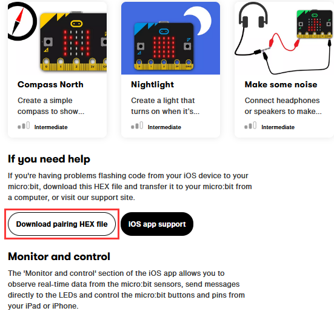

a. Open App Store

b. Search micro:bit and click“”icon to download

c. Pair your device with micro:bit V2

d. Turn on the Bluetooth of your device

e. Make sure micro:bit is interfaced with your computer.

f. After the installation, click and select“Choose micro:bit”to pair Bluetooth.

g. Select“Choose micro:bit”and click “Pair a new micro:bit”.

h. Press and hold button A and B simultaneously, then press and release the reset/power button. LED dot matrix will show a password pattern. At last, release the button A and B at same time and click“Next”.

i. Next, design the password image on your device, and make password image as same as micro:bit V2.

j. Click“Next”.

k. Then click“Next”and“Pair”. After a few seconds, micro:bit V2 will show “√” pattern if the pairing is successful.

l. Then edit code on app and upload it

m. Tap“Create Code”to enter the programming page. 

(Click, appear dialog box，and select “Create √”)

n. Name your program and click“” to save it. We name“1”for this program.

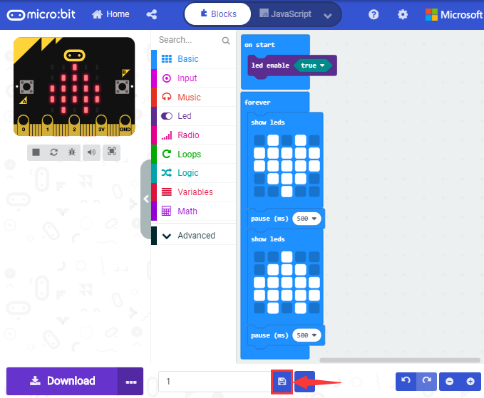

o. After the code is saved, click“Flash”and select program 1.

p. Next, tap“Flash”to transfer program 1 to micro:bit V2.

q. Micro:bit V2 will show the “Heartbeat”pattern if flashing is successful.

**4. Resource**

Download code:

[https://fs.keyestudio.com/KS0305](https://fs.keyestudio.com/KS0428)

<https://makecode.microbit.org/>

<https://tech.microbit.org/hardware/>

<https://microbit.org/new-microbit/>

<https://www.microbit.org/get-started/user-guide/overview/>

<https://microbit.org/get-started/user-guide/features-in-depth/>

<https://tech.microbit.org/hardware/edgeconnector/>

<https://microbit.org/guide/hardware/pins/>

[https://microbit.org/guide/quick/](Https://microbit.org/guide/quick/)

<https://microbit.org/get-started/user-guide/mobile/>

<https://microbit.org/code/>

<https://microbit.org/projects/>
